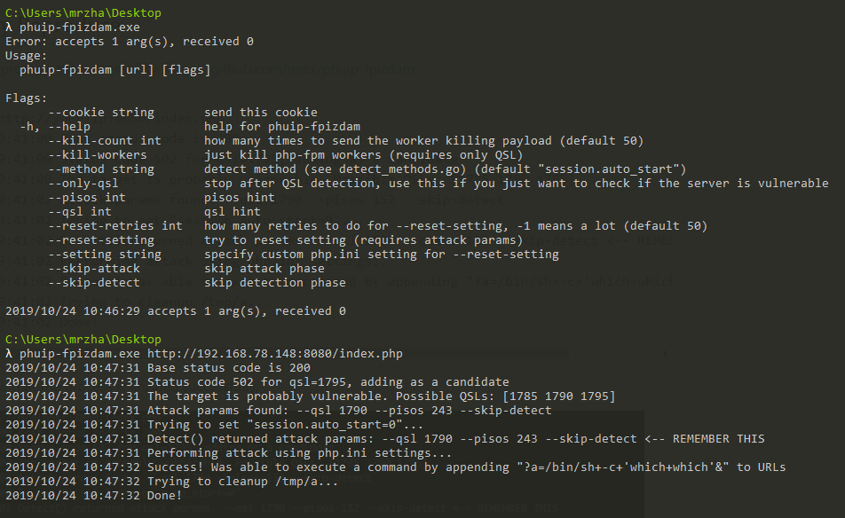
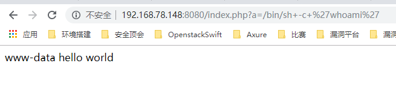

# Nginx+PHP-FPM配置不当任意代码执行

CVE-2019-11043

前天，在twit上看到了一个php-fpm的任意代码执行的disclosed，好像还是在Real World CTF中发现的， 发送 %0a 符号时，服务返回异常 ，在错误配置Nginx的情况下可以通过恶意构造的数据包，即可让PHP-FPM执行任意代码。 

**参考链接**

[漏洞披露](https://bugs.php.net/bug.php?id=78599)

[相关文章](https://lab.wallarm.com/php-remote-code-execution-0-day-discovered-in-real-world-ctf-exercise/)

[相关文章](https://github.com/jas502n/CVE-2019-11043)

[POC](https://github.com/neex/phuip-fpizdam)

[P师傅的环境]( https://github.com/vulhub/vulhub/blob/master/php/CVE-2019-11043 )


## 漏洞分析

如果你的web服务是使用nginx+php-fpm来搭建的，如果使用以下配置

```
location ~ [^/]\.php(/|$) {
  ...
  fastcgi_split_path_info ^(.+?\.php)(/.*)$;
  fastcgi_param PATH_INFO       $fastcgi_path_info;
  fastcgi_pass   php:9000;
  ...
}
```

不对脚本是否存在进行验证 (比如 `try_files`) 那么很有可能被攻击

当使用^与$的正则时`fastcgi_split_path_info ^(.+?\.php)(/.*)$;`可以使用%0A来注入任意 FastCGI 变量, 比如PHP_VALUE 


## 漏洞复现

使用P师傅的环境，下载并编译neex公布的[POC](https://github.com/neex/phuip-fpizdam)

```
docker-compose up -d
```





php-fpm会启动多个子进程，在访问`/index.php?a=id`时需要多访问几次，以访问到被污染的进程。，感觉很大一部分原因是前后端处理不一致导致的问题

## Patch

[commit](https://git.php.net/?p=php-src.git;a=commitdiff;h=19e17d3807e6cc0b1ba9443ec5facbd33a61f8fe)


## Last

存在很大一部分的使用nginx+php-fpm的应用存在该风险，建议及时自查。