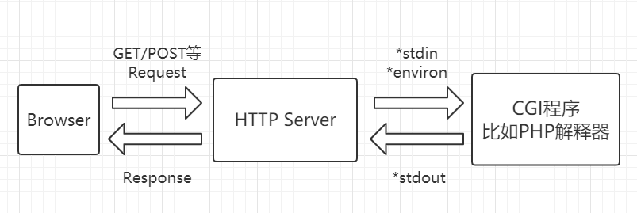
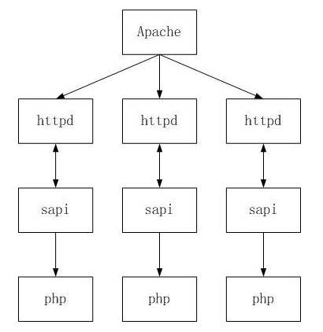
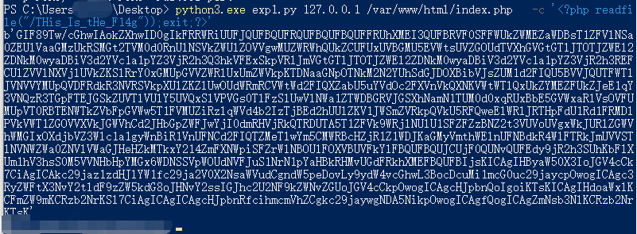
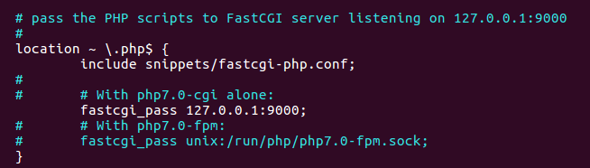
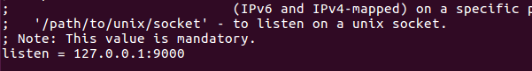
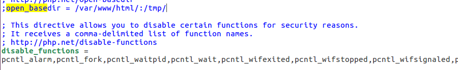
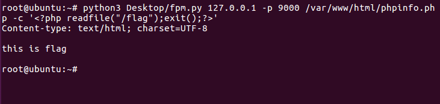

# 利用PHP-FPM实现open_basedir绕过


## 安装模式

在PHP中有以下几种常见的安装模式：

### CGI模式

CGI是通用网关接口，HTTP服务器使用这样的接口程序来调用外部程序，外部程序可以使用任何计算机语言来编写，例如C,C++,Perl,Visual Basic,Shell等等，历史上用来编写CGI程序使用最广泛的是Perl语言。

服务器在认为这是一个CGI请求时，会调用相关CGI程序，并通过环境变量和标准输出将数据传送给CGI程序，CGI程序处理完数据，生成html，然后再通过标准输出将内容返回给服务器，服务器再将内容交给用户浏览器，CGI进程退出。



CGI的出现让WEB从静态变为为动态，随着Web的越来越普及，很多的网站的都需要有动态的页面，以便与浏览者互交。CGI方式的缺点也越来越突出。因为HTTP要生成一个动态页面，系统就必须启动一个新的进程以运行CGI程序，CGI采用fork and execution方式，每次请求都需要新建立CGI程序来进行处理，不断地fork是一项很消耗时间和资源的工作，导致性能的低下。这就出现了FastCGI。


### FastCGI模式

FastCGI是从CGI发展改进而来的。传统CGI接口方式的主要缺点是性能很差，因为每次HTTP服务器遇到动态程序时都需要重新启动脚本解析器来执行解析，然后结果被返回给HTTP服务器。这在处理高并发访问时，几乎是不可用的。另外传统的CGI接口方式安全性也很差，现在已经很少被使用。FASTCGI快速通用网关接口是常驻内存的CGI，实际上是对CGI程序的进程管理，FastCGI接口方式采用C/S结构，可以将HTTP服务器和脚本解析服务器分开，同时在脚本解析服务器上启动一个或者多个脚本解析守护进程。当HTTP服务器每次遇到动态程序时，可以将其直接交付给FastCGI进程来执行，然后将得到的结果返回给浏览器。这种方式可以让HTTP服务器专一地处理静态请求或者将动态脚本服务器的结果返回给客户端，这在很大程度上提高了整个应用系统的性能。


### Module模式

Module模式就是把php作为apache的一个子模块来运行，使用LoadModule来加载php模块，比如在apache的配置文件中

```
//httpd.conf
LoadModule php7_module "${INSTALL_DIR}/bin/php/php7.2.13/php7apache2_4.dll"
```

当web访问php文件时，apache会调用php模块来解析，phpmodule通过sapi来把数据传递给php解析器进行解析。




### PHP-FPM模式

最后是本篇文章的主角PHP-FPM，FPM是一个FastCGI协议解析器，Nginx等服务器中间件将用户请求按照FastCGI的规则打包好发送给PHP-FPM，再由PHP-FPM来将打包的数据进行解析并与FastCGI进行通信，PHP-FPM就是为了实现和管理FastCGI协议的进程（fastcgi进程管理器），管理一个进程池，处理来自于web服务器的请求。其中，Ngnix与PHP-FPM有两种通信方式，分别是TCP与Unix domain sockets模式。在windows系统中只能使用tcp socket的通信方式。

**TCP模式**

TCP模式是PHP-FPM进程监听本机上端口（默认为9000），Ngnix将用户请求按照fastcgi的规则打包好发送给php-fpm，由PHP-FPM调用cgi进行解析。TCP通信模式允许通过网络进程之间的通信，也可以通过loopback进行本地进程之间通信。

**Unix domain sockets模式**

Unix socket 又叫 IPC (inter-process communication 进程间通信) socket，用于实现同一主机上的进程间通信，这种方式需要在 Ngnix配置文件中填写 PHP-FPM 的 socket 文件位置。


在P神的[Fastcgi协议分析 && PHP-FPM未授权访问漏洞 && Exp编写](https://www.leavesongs.com/PENETRATION/fastcgi-and-php-fpm.html)这篇文章中对其中的原理已经做了比较详细的解释：

假如用户访问

```
http://127.0.0.1/index.php?a=1&b=2
```

如果web 目录为 `/var/www/html`，Nginx将请求变成键值对

```
{
    'GATEWAY_INTERFACE': 'FastCGI/1.0',
    'REQUEST_METHOD': 'GET',
    'SCRIPT_FILENAME': '/var/www/html/index.php',
    'SCRIPT_NAME': '/index.php',
    'QUERY_STRING': '?a=1&b=2',
    'REQUEST_URI': '/index.php?a=1&b=2',
    'DOCUMENT_ROOT': '/var/www/html',
    'SERVER_SOFTWARE': 'php/fcgiclient',
    'REMOTE_ADDR': '127.0.0.1',
    'REMOTE_PORT': '12345',
    'SERVER_ADDR': '127.0.0.1',
    'SERVER_PORT': '80',
    'SERVER_NAME': "localhost",
    'SERVER_PROTOCOL': 'HTTP/1.1'
}
```

这个数组其实就是PHP中`$_SERVER`数组的一部分，也就是PHP里的环境变量。其作用不仅是填充`$_SERVER`数组，也是在告诉FPM要执行哪个PHP文件。当PHP-FPM拿到了数据包在之后，进行解析，得到了环境变量，然后执行`SCRIPT_FILENAME`的值指向的PHP文件，即`/var/www/html/index.php`。


## 如何利用

PHP-FPM默认监听9000端口，如果这个端口暴露在公网，则我们可以自己构造FastCGI协议，和FPM进行通信。这时候可以利用`SCRIPT_FILENAME`来指定执行php文件，如果文件不存在则返回404。在Nginx中存在一个配置限定了只有带某些后缀的文件才允许被PHP-FPM执行，默认为`.php`，`security.limit_extensions`

```
; Limits the extensions of the main script FPM will allow to parse. This can
; prevent configuration mistakes on the web server side. You should only limit
; FPM to .php extensions to prevent malicious users to use other extensions to
; exectute php code.
; Note: set an empty value to allow all extensions.
; Default Value: .php
;security.limit_extensions = .php .php3 .php4 .php5 .php7
```

为了避免404，首先需要找到已存在的PHP文件，如果不知道web的绝对路径或者web目录下的php文件名，可以使用全局搜索得到环境中默认的php文件。

```
find / -name "*.php"
```

在我们获得一个webshell的时候，怎么能突破限制执行任意PHP代码呢？

首先我们能控制`SCRIPT_FILENAME`，让fpm执行的任意文件，但是也只是执行目标服务器上的文件，并不能执行我们需要其执行的文件，但是在PHP中有很多有趣的技巧，比如在php.ini中有两个配置项

```
auto_prepend_file    //在执行目标文件之前，先包含auto_prepend_file中指定的文件
auto_append_file     //在执行完成目标文件后，包含auto_append_file指向的文件
```

如果设置auto_prepend_file为php://input，则相当于执行任何php文件之前会包含$_POST中的内容，使用php://input需要开启远程文件包含(allow_url_include)。

在PHP-FPM中还会解析两个环境变量

```
PHP_VALUE                 //用于设置PHP的配置项，除 disable_function 以外的大部分 php 配置
PHP_ADMIN_VALUE
```

设置`auto_prepend_file = php://input`且`allow_url_include = On`，然后将我们需要执行的代码放在Body中，即可执行任意代码。

```
{
    'GATEWAY_INTERFACE': 'FastCGI/1.0',
    'REQUEST_METHOD': 'GET',
    'SCRIPT_FILENAME': '/var/www/html/index.php',
    'SCRIPT_NAME': '/index.php',
    'QUERY_STRING': '?a=1&b=2',
    'REQUEST_URI': '/index.php?a=1&b=2',
    'DOCUMENT_ROOT': '/var/www/html',
    'SERVER_SOFTWARE': 'php/fcgiclient',
    'REMOTE_ADDR': '127.0.0.1',
    'REMOTE_PORT': '12345',
    'SERVER_ADDR': '127.0.0.1',
    'SERVER_PORT': '80',
    'SERVER_NAME': "localhost",
    'SERVER_PROTOCOL': 'HTTP/1.1'
    'PHP_VALUE': 'auto_prepend_file = php://input',
    'PHP_ADMIN_VALUE': 'allow_url_include = On'
}
```

以上介绍的只是对PHP-FPM进行攻击的正常流程，假如环境中增加了disable_functions的限制，如果使用包含`PHP_VALUE`==`disable_function=`的恶意FastCgi攻击FPM时，只能修改展示phpinfo信息的`EG(ini_directives)`，也就是表面修改，对于已经禁用的函数无效的。


## 实例解析

以SUCTF2019中的一道题为例easyphp，在获得webshell以后，发现有disable_functions的限制，这里可以通过与php-fpm进行通信来绕过open_basedir。

这里想要获得flag需要利用php_value对open_basedir的值进行重设

```
'PHP_VALUE': 'auto_prepend_file = php://input'+chr(0x0A)+'open_basedir = /',
```



官方给的环境很有问题，少了upload目录，需要自行加上，进去以后直接用官方给的exp复现也没成功，进去docker发现php-fpm根本没有起，emmmm醉了

直接在ubuntu16.04起一个phpfpm

```
sudo apt update
sudo apt install -y nginx
sudo apt install -y software-properties-common
sudo add-apt-repository -y ppa:ondrej/php
sudo apt update
sudo apt install -y php7.3-fpm
```

修改nginx站点文件

```
sudo vim /etc/nginx/sites-enabled/default
```



启用unix socket模式

```
sudo vim /etc/php/7.3/fpm/pool.d/www.conf
```

配置php-fpm监听，将listen参数修改为127.0.0.1:9000



重启php-fpm和nginx

```
/etc/init.d/php7.3-fpm restart
service nginx restart
```


修改相应的open_basedir



利用php-fpm通信来修改basedir，用p神的脚本修改一下


最后绕过open_basedir成功




## 参考链接

https://php-fpm.org/

https://www.awaimai.com/371.html

https://bugs.php.net/bug.php?id=70134

[http://www.rai4over.cn/2019/06/11/PHP%E5%86%85%E6%A0%B8%E5%88%86%E6%9E%90-FPM%E5%92%8Cdisable-function%E5%AE%89%E5%85%A8%E9%97%AE%E9%A2%98/](http://www.rai4over.cn/2019/06/11/PHP内核分析-FPM和disable-function安全问题/)

https://www.cnblogs.com/Alight/p/4709753.html

https://forum.90sec.com/t/topic/129

https://www.leavesongs.com/PENETRATION/fastcgi-and-php-fpm.html

[http://lonelyrain.me/2017/10/10/PHP%E8%87%AA%E5%8A%A8%E6%96%87%E4%BB%B6%E6%89%A9%E5%B1%95%E5%AE%89%E5%85%A8%E7%A0%94%E7%A9%B6/](http://lonelyrain.me/2017/10/10/PHP自动文件扩展安全研究/)