# PHP临时文件机制与利用

## List
1. 文件自包含 [文件自包含](./POC1)
2. php://filter/string.strip_tags [php://filter/string.strip_tags](./POC2)
3. convert.quoted-printable-encode [convert.quoted-printable-encode](./POC3)


## 0x00 起因

​	这几天在研究session.upload的机制的时候，发现文件上传以后会在临时存储目录下生成文件名为php\*\*.tmp的文件，而且该文件内容就是上传的内容，于是就想好好了解一下PHP中的临时文件的机制。

## 0x01 了解PHP临时文件

​	在PHP中可以使用POST方法或者PUT方法进行文本和二进制文件的上传。
​	上传后会文件会保存在全局变量$_FILES里，该数组包含了所有上传文件的文件信息。

1. $_FILES\['userfile']['name']        客户端文件的原名称。

2. $_FILES\['userfile']['type']        文件的 MIME 类型，如果浏览器提供该信息的支持，例如"image/gif"。

3. $_FILES\['userfile']['size']        已上传文件的大小，单位为字节。

4. $_FILES\['userfile']['tmp_name']        文件被上传后在服务端储存的临时文件名，一般是系统默认。可以在php.ini的upload_tmp_dir 指定，默认是/tmp目录。

5. $_FILES\['userfile']['error']        该文件上传的错误代码，上传成功其值为0，否则为错误信息。

6. $_FILES\['userfile']['tmp_name']        文件被上传后在服务端存储的临时文件名

   

   这里的重点就是**$_FILES\['userfile']['tmp_name']** 这个变量。

   

### 临时文件的存储目录

​	文件被上传后，默认会被存储到服务端的默认临时目录中，该临时目录由**php.ini**的**upload_tmp_dir**属性指定，假如**upload_tmp_dir**的路径不可写，PHP会上传到系统默认的临时目录中，假如开启了**open_basedir**，要想成功上传，系统默认临时目录需要指定PHP可访问。

​	在wamp中，**upload_tmp_dir**属性默认为wamp安装目录下的tmp文件夹，如下图所示：

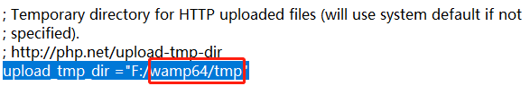

​	在Centos7中，**upload_tmp_dir**没有指定，所以会使用系统默认临时目录，这里是**/tmp**目录，该属性可以通过**sys_get_temp_dir()**函数来获得

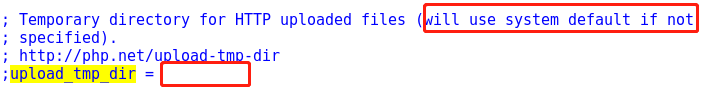

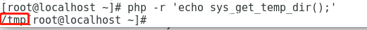

### 临时文件的命名规则

在上传存储到临时目录后，**临时文件命名的规则如下**:
默认为 php+4或者6位随机数字和大小写字母  

```
php[0-9A-Za-z]{4,6}    //根据系统的不同调用不同的方法生成临时文件名
```

比如   ：

phpXXXX.tmp   在windows下有tmp后缀，且文件随机字符为四位

而在linux没有后缀，但是文件随机字符一般为六位，phpXXXXXX

​	windows下，在windows环境中，php会调用**GetTempFileName**方法，具体定义在源码的**php_open_temporary_file.c**中

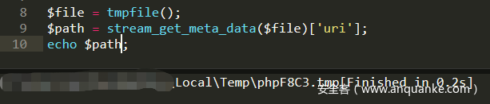


​	在linux下则是适用**mkstemp**方法，此方法依赖于glibc的编译方式，通常生成6位随机数，范围为62个字符（A-Za-z0-9）


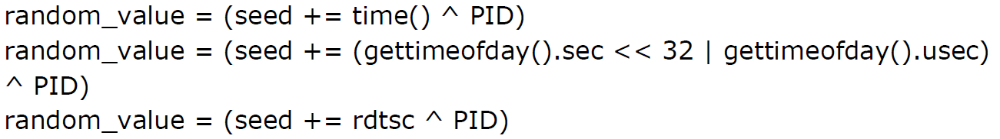


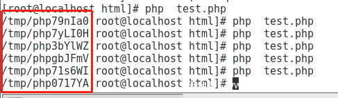


### 临时文件的正常存活周期

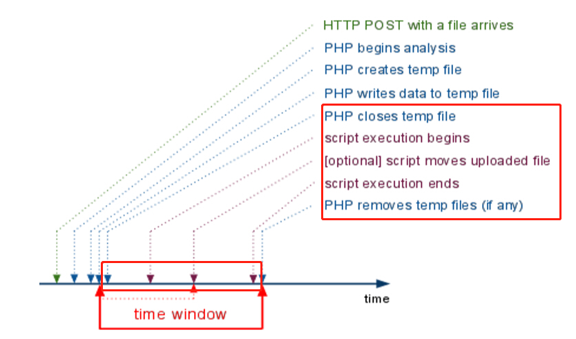
	上面这张图是PHP在通过POST方法上传文件时的运行周期图，可以看到我们临时文件的存活周期就是上图红色框中的时间段。

​	另外，如果在php运行的过程中，假如php非正常结束，比如崩溃，那么这个临时文件就会永久的保留。

​	如果php正常的结束，并且该文件没有被移动到其它地方也没有被改名，则该文件将在表单请求结束时被删除。


## 0x02 如何利用？

​	既然了解了PHP上传会产生临时文件，并且文件内容可控，那我们就不禁要思考思考，这里有没有存在可以利用的点呢？
​	这就有以下几个问题：

### 问题一：如何能够访问到该临时文件？

​	由于临时文件目录一般不可访问，因此想要利用临时文件一般需要配合文件包含，或者某些ssrf结合包含来进行利用。

### 问题二：如何获得临时文件的文件名？

1. 在前面介绍过临时文件的命名规则，因此，当我们获得了一个文件包含点时，可以通过暴力猜解文件名来得到。这时最朴素，最笨拙的方法，但也是最有效的方法。
2. 在windows中，利用了**FindFirstFile**方法，可以通过通配符来进行文件包含，在linux中也有相应的一些方法。
3. 第三种方法就是通过**/proc/self/fd/xxx**来获得，xxx从10开始，这里获得的时当前运行进程ID的一些符号链接，这个方式的有效性取决于上传文件的大小，大文件可以增加尝试的时间。

获得文件名的方法应该有很多，这里只列举最笨拙的几种，各位大大应该都有各种各样的一些骚姿势。

### 问题三：如何在php运行时间内包含到该临时文件？

1. 本地文件包含可以让php**包含自身**从而导致死循环，然后php守护进程产生内存溢出，然后php会崩溃，php自身是不会因为错误直接退出的，它会清空自己的内存堆栈，以便从错误中恢复，这就保证了web服务的正常运转的同时，打断了php对临时文件的处理，在这个时候对任一php文件进行post文件请求，临时文件就会被保留。
   正常的执行流程应该如下图所示：
   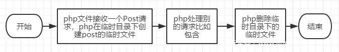
   而在漏洞利用过程中：
   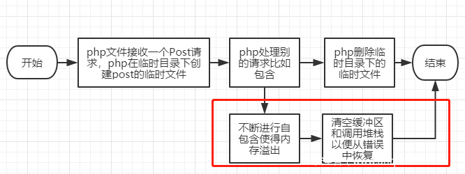
   因此临时目录下的临时文件有部分得以保存，再通过包含这部分文件即可getshell。

   在实际测试过程中，在php较低版本中使用自包含的方式可以很稳定的利用，比如5.5.9

   在我使用wamp分别测试了版本是7.2.14和7.1.26和7.0.33和5.6.40的php版本时，利用这个方法只能使临时文件存在时间延长到5s，但是最后还是会删除，如果能在这5s内包含到文件也算是成功利用，不过这难度太大，如果有好的思路希望师傅们可以交流。

   新起一个docker（php:apache） ，版本就是latest的，尝试适用多线程去跑，开了50个线程

   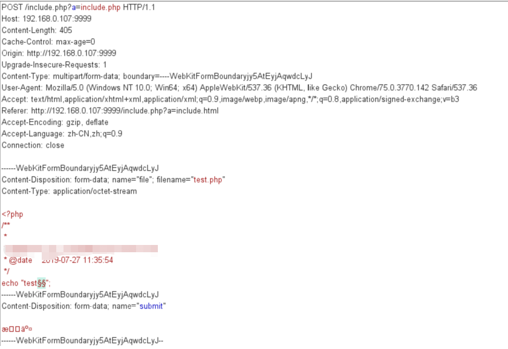

   payload选择null payloads并选择持续的跑，跑了一段时间之后就可以停止了。

   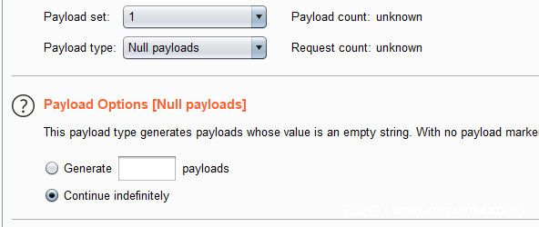
   在docker中观察，如果一直开着，临时文件始终保持50个，停止之后，临时文件奇怪的先增加了，然后又减少，一直到最后，有部分文件被保存了下来，回想起前面说的，php只有正常结束临时文件才会清除，因此这可能跟配置有关，比如一大堆的请求阻塞着，最后某些线程崩溃，导致部分文件被驻留在tmp目录。
   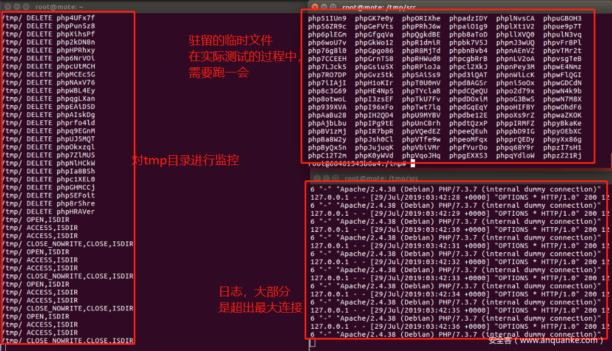
   这个时候就可以跑脚本来爆破文件名，为了不占字数，我把脚本都放在文末的附录中，这里要注意有可能因为前面访问次数太频繁而被禁止访问出现Max retries exceeded with url错误，需要更换代理来爆破文件名，或者捕获Connection error来进行处理。

2. 根据@王一航师傅去年的一个发现，利用**php://filter/string.strip_tags**造成崩溃。在含有文件包含漏洞的地方，使用**php://filter/string.strip_tags**导致php崩溃清空堆栈重启，如果在同时上传了一个文件，那么这个tmp file就会一直留在tmp目录，再进行文件名爆破就可以getshell，这个崩溃原因是存在一处空指针引用。

   根据师傅所说这个点只在php7.2以下存在，我把大部分的版本都测了一下。

   经过测试，该方法仅适用于以下php7版本，php5并不存在该崩溃：

   ​	•  php7.0.0-7.1.2可以利用，  7.1.2x版本的已被修复
   ​	•  php7.1.3-7.2.1可以利用，  7.2.1x版本的已被修复
   ​	•  php7.2.2-7.2.8可以利用，  7.2.9一直到7.3到现在的版本已被修复

   

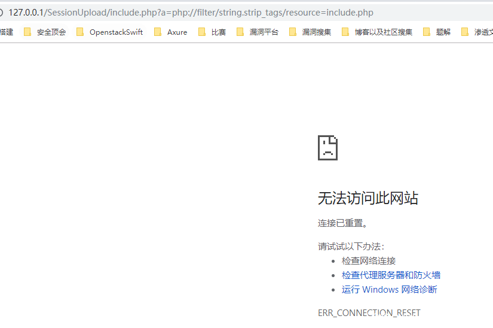
临时文件由于崩溃成功保留下来
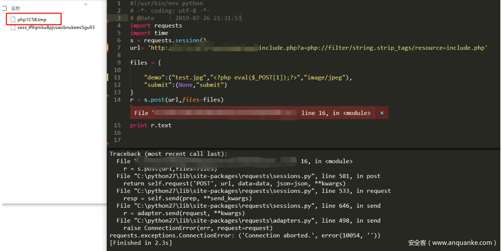


3. 利用wupco师傅发现的**filter:`convert.quoted-printable-encode`**导致的segment fault。实际上，这个崩溃并不适用于include，require等函数，经过测试，该方法适用于以下版本（201812月以前的版本，由于师傅提交了因此之后的版本修复了，tql）的以下函数（file函数，file_get_contents函数，readfile函数）：

   ​	• php7.0.0-7.0.32
   ​	• php7.0.4-7.2.12
   ​	• php<=5.6.38的版本

   这里要说明下5.6.39-5.6.9以内的版本并不存在这个崩溃
   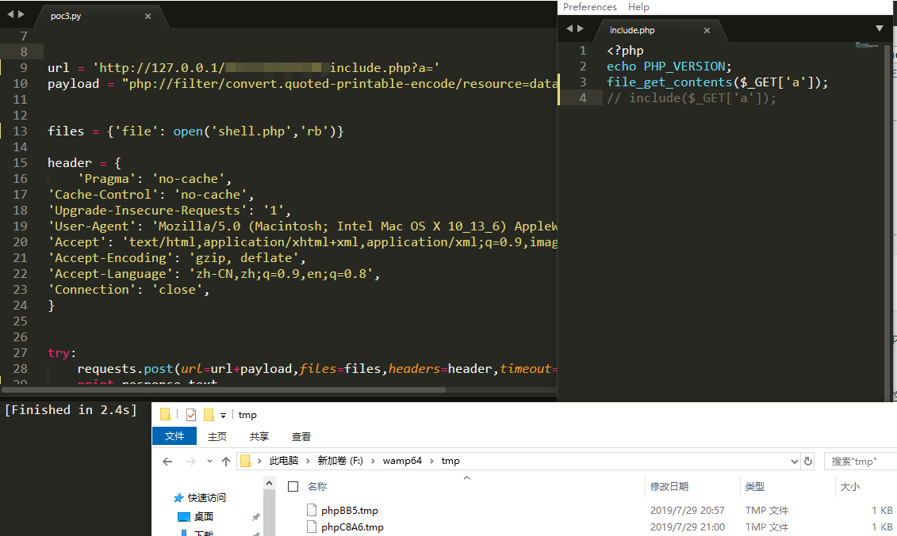


在这里介绍的三种方式中，自包含是最不稳定的而且经常阻塞服务器，除非版本较低，一般不选择，第二第三种只要符合特定版本，就可以稳定利用，最后爆破文件名来利用。

## 0x03 总结与附录

对PHP临时文件机制的学习让我对如何利用LFI有了新的方向，如果我们fuzz一下，是否可以找到新的导致php崩溃的方法，这也许可以给接下来的日子挖一个坑。

文章中所用到的文件名爆破脚本和上传脚本以及测试代码都已经上传至github

https://github.com/Mote-Z/PHP-Is-The-Best/tree/master/PHP_Tempfile_Exploit

## 0x04 参考文献

1.`https://insomniasec.com/downloads/publications/LFI%20With%20PHPInfo%20Assistance.pdf`
2.`http://gynvael.coldwind.pl/download.php?f=PHP_LFI_rfc1867_temporary_files.pdf`
3.`https://www.php.net/manual/zh/features.file-upload.post-method.php`
4.`https://repo.zenk-security.com/Techniques%20d.attaques%20%20.%20%20Failles/HTTP%20HEAD%20method%20trick%20in%20php%20scripts.pdf`
5.`https://hackmd.io/@ZzDmROodQUynQsF9je3Q5Q/rJlfZva0m?type=view`
6.`https://www.jianshu.com/p/dfd049924258`
7.`https://bugs.php.net/bug.php?id=77231`
8.`https://spyclub.tech/2018/12/21/one-line-and-return-of-one-line-php-writeup/`